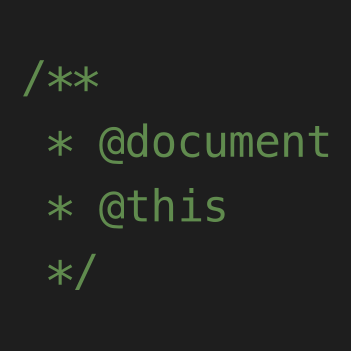

# Document This
This Visual Studio Code extension automatically generates detailed JSDoc comments for both TypeScript and JavaScript files.

# Functionality
"Document This" generates thorough JSDoc comments with support for @class, @constant, @enum, @exports, @function, @implements, @interface, @param, @private, @returns, @static and @type.

# Commands
## Document This (`Windows: Ctrl-Shift-D Ctrl-Shift-D, Mac: Cmd-Shift-D Cmd-Shift-D`)
Generates documentation for whatever the carat is on or inside of.
## Document Everything (`Windows: Ctrl-Shift-D Ctrl-Shift-E, Mac: Cmd-Shift-D Cmd-Shift-E`)
Generates documentation for everything in the document that is supported by the extension.
## Document Everything Visible (`Windows: Ctrl-Shift-D Ctrl-Shift-D, Mac: Cmd-Shift-D Cmd-Shift-D`)
Generates documentation for everything in the document that is supported by the extension.

